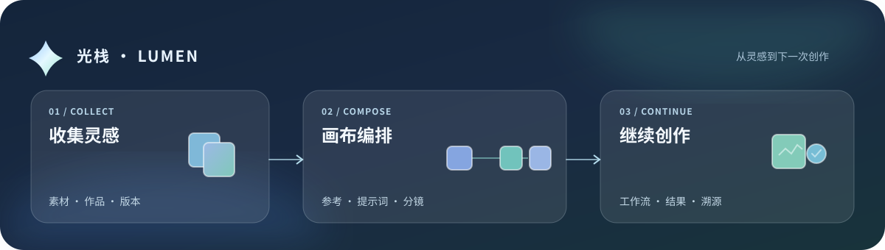
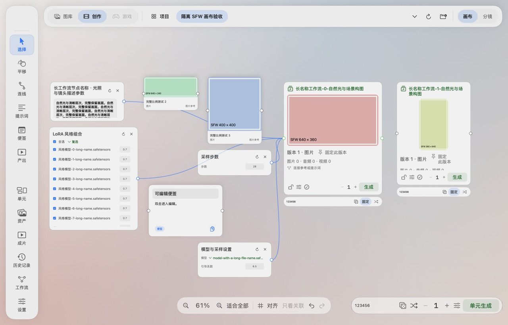

<p align="center">
  
</p>
<h1 align="center">光栈 · Lumen</h1>
<p align="center">
  <strong>让灵感随时延续，让创作秩序井然。</strong><br>
  一座为 Apple Silicon Mac 打造的本地视觉图库，也是一张能继续创作的项目画布。
</p>
<p align="center">
  <a href="https://github.com/limyum-creator/lumen-releases/releases/tag/v0.8.5"></a>
  
  
</p>
<p align="center">
  <a href="https://github.com/limyum-creator/lumen-releases/releases/tag/v0.8.5"><strong>⬇️ 下载 0.8.5 内测版</strong></a>
  &nbsp;·&nbsp; <a href="QUICKSTART.md">快速上手</a>
  &nbsp;·&nbsp; <a href="Agent连接指南.txt">Agent 接入</a>
  &nbsp;·&nbsp; <a href="https://github.com/limyum-creator/lumen-releases/issues">反馈问题</a>
</p>

<p align="center"></p>

## 从素材到成果，留在同一个工作台

| 收集与查找 | 画布与叙事 | 工作流与版本 |
| :-- | :-- | :-- |
| 图片、视频与音频放进本地图库；监听文件夹自动收录，保留素材来源。空格预览、作品版本与双图对比让回看更轻松。 | 在项目 → 单集 → 单元中组织创作；把参考、提示词、便签和产出卡摆到画布上，按需要连线与编排分镜。 | 可选连接 ComfyUI 或 RunningHub，按产出卡配置工作流；结果回收入库，关联提示词、参数与版本，方便继续探索。 |

### 看一眼画布

<picture>
  <source media="(prefers-color-scheme: dark)" srcset="assets/canvas-sample-dark.jpg">
  
</picture>

<sub>画布示意使用隔离 SFW 合成数据和原生组件宿主缓存绘制；不是正式图库、实际生成结果或屏幕录制。可切换 [浅色](assets/canvas-sample-light.jpg) / [深色](assets/canvas-sample-dark.jpg) 查看静态样例。玻璃效果、动效与实体触控板手感仍须以实际设备体验为准。</sub>

## 为什么用光栈

- **作品有上下文**：同一作品的不同版本并存，提示词、种子及工作流参数随版本可回看；可固定满意的版本，不覆盖此前尝试。
- **创作有空间**：画布里的参考素材、提示词和工作流产出直观关联；项目、单集和单元各司其职，支持延续长线叙事。
- **资产在自己手里**：图库保存在你指定的本地文件夹。浏览、整理无需连接生成后端；只有选择云端生成等联网功能时才会与相应服务通信。
- **可与 Agent 协作**：随包提供 MCP 接入指南；连接后可让具备本地权限的助手读取与整理项目内容，无需另外安装 Python 运行环境。

## 下载与安装

**当前公开内测版：0.8.5（22.7）** · macOS 14+ · Apple Silicon。免费内测，无需激活码。

1. 从 [v0.8.5 Release](https://github.com/limyum-creator/lumen-releases/releases/tag/v0.8.5) 下载 **[Lumen-0.8.5-arm64.dmg](https://github.com/limyum-creator/lumen-releases/releases/download/v0.8.5/Lumen-0.8.5-arm64.dmg)** 和 [SHA-256 校验文件](https://github.com/limyum-creator/lumen-releases/releases/download/v0.8.5/Lumen-0.8.5-arm64.sha256)。GitHub 自动提供的 “Source code” 压缩包**不是**安装包。
2. 核对校验值后，退出旧版，打开 DMG，把 **光栈.app** 拖入“应用程序”；升级不会主动覆盖原图库和设置。
3. 第一次打开选择新建或打开现有图库。ComfyUI、RunningHub、Agent 都是可选连接，所需模型、节点、账号及额度由你自行准备。

```sh
shasum -a 256 -c Lumen-0.8.5-arm64.sha256
```

> **关于首次打开**：对外包目前未经过 Apple 公证。若 macOS 阻止启动，可在“系统设置 → 隐私与安全性”中确认打开；请只从本仓库 Release 下载并核对 SHA-256。此版本只支持 Apple Silicon，不提供 Intel 或 Windows 安装包。

## 上手与反馈

- [三分钟快速上手](QUICKSTART.md) · [完整使用指南](光栈快速上手.txt) · [Agent 连接指南](Agent连接指南.txt)
- 备份或迁移图库时，请完整复制图库目录，**包括隐藏的 `.lumen` 文件夹**；它保存项目与版本关系。先退出应用再备份。
- 想了解本次新增内容与已知验收边界，请看 [0.8.5 发布记录](https://github.com/limyum-creator/lumen-releases/releases/tag/v0.8.5)。真实大型工作流、其他设备与触控板观感尚未逐一实测，欢迎到 [Issues](https://github.com/limyum-creator/lumen-releases/issues) 反馈。
